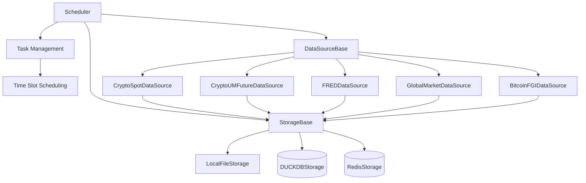

# 🕒 ChronoForge

ChronoForge 是一个异步、插件式的时间序列数据处理框架，专注于高效获取、存储和管理各种时间序列数据。

## 🚀 主要特性

- 🔌 **插件架构** — 可自由扩展自定义数据源和存储插件，内置多种常用数据源
- ⚙️ **异步调度** — 高效管理并行读取和序列化写入，支持多任务并发执行
- 🧩 **关注点分离** — 每个组件专注于自己的职责，确保清晰性和模块化
- 🧠 **自动分页和增量更新** — 只获取缺失的数据段，避免重复下载
- ⏱️ **统一时间戳管理** — 避免时区不一致问题，所有时间戳统一为毫秒级
- 📊 **多种数据源支持** — 内置加密货币、FRED经济数据、全球市场数据等数据源
- 💾 **灵活存储选项** — 支持本地文件、DuckDB、Redis等多种存储方式
- 🎯 **任务调度** — 支持基于时间槽的任务调度，可配置执行时间

## 📦 安装

### 1. 从源码安装

如果您下载了源代码，可以使用以下命令安装：

```bash
# 从源码安装（开发模式）
pip install -e .

# 或使用 requirements.txt 安装依赖
pip install -r requirements.txt
```

### 2. 从PyPI安装（未来支持）

```bash
# 从PyPI安装（未来支持）
# pip install chronoforge
```

## 🧱 核心架构

### 1. `Scheduler`

**调度器** 是 ChronoForge 的中央控制器，负责工作流程编排和任务管理。

**主要职责：**

- 管理所有插件实例（数据源和存储）
- 支持基于时间槽的任务调度
- 处理并行读取和序列化写入
- 管理任务状态和执行结果
- 内置线程池，支持多任务并发执行

### 2. `DataSourceBase` (数据源基类)

每个数据源插件继承自 `DataSourceBase`，负责从特定源获取数据。

**内置数据源插件：**

- `CryptoSpotDataSource` — 加密货币现货数据
- `CryptoUMFutureDataSource` — 加密货币永续合约数据
- `FREDDataSource` — FRED经济数据
- `GlobalMarketDataSource` — 全球市场数据
- `BitcoinFGIDataSource` — 比特币恐惧与贪婪指数

**核心方法：**

- `fetch()` — 从数据源获取数据
- `validate_data()` — 验证数据完整性
- `close_all_connections()` — 关闭数据源连接

### 3. `StorageBase` (存储基类)

存储插件继承自 `StorageBase`，负责数据的持久化和更新。

**内置存储插件：**

- `LocalFileStorage` — 本地文件存储
- `DUCKDBStorage` — DuckDB数据库存储
- `RedisStorage` — Redis数据库存储

**核心方法：**

- `save()` — 保存数据
- `load()` — 加载数据
- `exists()` — 检查数据是否存在

## 🚦 快速开始

### 1. 嵌入模式

以下是一个简单的示例，展示如何在嵌入模式下使用 ChronoForge 获取加密货币数据：

```python
import asyncio
from chronoforge import Scheduler
from chronoforge.utils import TimeSlot

async def main():
    # 创建调度器
    scheduler = Scheduler(max_workers=5)
    
    # 定义时间槽（每天00:00执行）
    time_slot = TimeSlot(hour=0, minute=0)
    
    # 添加任务：获取比特币现货数据
    scheduler.add_task(
        name="btc_spot_data",
        data_source_name="CryptoSpotDataSource",
        data_source_config={"api_key": "your_api_key", "api_secret": "your_api_secret"},
        storage_name="DUCKDBStorage",
        storage_config={"db_path": "./data/chronoforge.db"},
        time_slot=time_slot,
        symbols=["binance:BTC/USDT"],
        timeframe="1h",
        timerange_str="20240101-"
    )
    
    # 启动调度器
    scheduler.start()
    
    # 运行5秒后停止
    await asyncio.sleep(5)
    scheduler.stop()

# 运行
asyncio.run(main())
```

### 2. 自运行模式

ChronoForge 还支持作为独立服务运行，通过 RESTful API 提供访问。

#### 2.1 启动服务

##### 2.1.1 安装包后启动服务

如果您已经通过 `pip install -e .` 或 `pip install chronoforge` 安装了 ChronoForge，可以直接使用 `chronoforge` 命令启动服务：

```bash
# 基本用法（默认主机：127.0.0.1，默认端口：8000）
chronoforge serve

# 自定义主机和端口
chronoforge serve --host 0.0.0.0 --port 8000

# 开发模式（代码修改时自动重载）
chronoforge serve --reload

# 指定工作进程数
chronoforge serve --workers 4
```

##### 2.1.2 下载源代码后启动服务

如果您下载了源代码但尚未安装，可以使用以下方式启动服务：

```bash
# 使用 python -m 方式启动服务
python -m chronoforge.cli serve --host 0.0.0.0 --port 8000

# 或直接运行 cli.py 文件
python chronoforge/cli.py serve --host 0.0.0.0 --port 8000
```

##### 2.1.3 服务启动参数

| 参数 | 描述 | 默认值 |
|------|------|--------|
| `--host` | 服务绑定的主机地址 | `127.0.0.1` |
| `--port` | 服务绑定的端口 | `8000` |
| `--reload` | 开发模式，代码修改时自动重载 | `False` |
| `--workers` | 工作进程数 | `1` |

#### 2.2 API 访问

服务启动后，可以通过以下地址访问 API：

- **服务地址**: http://localhost:8000
- **API文档**: http://localhost:8000/docs （Swagger UI）
- **ReDoc文档**: http://localhost:8000/redoc

#### 2.3 核心 API 端点

| 方法 | 端点 | 描述 |
|------|------|------|
| GET | /api/status | 获取服务状态 |
| GET | /api/tasks | 列出所有任务 |
| POST | /api/tasks | 创建新任务 |
| GET | /api/tasks/{task_name} | 获取任务详情 |
| DELETE | /api/tasks/{task_name} | 删除任务 |
| POST | /api/tasks/{task_name}/start | 启动任务 |
| POST | /api/tasks/{task_name}/stop | 停止任务 |
| GET | /api/plugins | 列出所有支持的插件 |
| GET | /api/plugins/{plugin_type} | 按类型列出插件 |

#### 2.4 API 示例

##### 获取服务状态

```bash
curl http://localhost:8000/api/status
```

##### 列出所有插件

```bash
curl http://localhost:8000/api/plugins
```

##### 创建新任务

```bash
curl -X POST http://localhost:8000/api/tasks \
  -H "Content-Type: application/json" \
  -d '{
    "name": "test_task",
    "data_source_name": "CryptoSpotDataSource",
    "data_source_config": {},
    "storage_name": "LocalFileStorage",
    "storage_config": {},
    "time_slot": {
      "start": "00:00",
      "end": "23:59"
    },
    "symbols": ["binance:BTC/USDT"],
    "timeframe": "1d",
    "timerange_str": "20240101-"
  }'
```

##### 列出所有任务

```bash
curl http://localhost:8000/api/tasks
```

#### 2.4 使用示例

ChronoForge 提供了示例文件，展示如何使用 RESTful API 与服务交互：

```bash
# 运行 RESTful API 示例
python examples/restful_api.py
```

该示例文件将：

- 检查 ChronoForge 服务是否正在运行
- 如果服务未运行，则启动服务
- 向服务添加多个任务
- 监控任务状态变化
- 运行一段时间后停止服务（如果是示例启动的服务）

## 📁 项目结构

```
ChronoForge/
├── chronoforge/          # 主包
│   ├── __init__.py       # 包初始化
│   ├── scheduler.py      # 调度器实现
│   ├── cli.py            # 命令行工具
│   ├── utils.py          # 工具函数
│   ├── data_source/      # 数据源插件
│   │   ├── __init__.py   # 数据源包初始化
│   │   ├── base.py       # 数据源基类
│   │   ├── crypto_spot.py # 加密货币现货数据源
│   │   ├── fred.py       # FRED经济数据源
│   │   └── ...           # 其他数据源
│   ├── storage/          # 存储插件
│   │   ├── __init__.py   # 存储包初始化
│   │   ├── base.py       # 存储基类
│   │   ├── localfile.py  # 本地文件存储
│   │   ├── duckdb.py     # DuckDB存储
│   │   └── redisdb.py    # Redis存储
│   └── server/           # HTTP服务
│       ├── __init__.py   # 服务包初始化
│       ├── main.py       # FastAPI应用入口
│       ├── dependencies.py # 依赖管理
│       ├── api/          # API路由
│       │   ├── __init__.py
│       │   ├── tasks.py  # 任务管理API
│       │   ├── plugins.py # 插件管理API
│       │   └── status.py # 状态查询API
│       └── models/       # Pydantic模型
│           ├── __init__.py
│           ├── task.py   # 任务相关模型
│           └── plugin.py # 插件相关模型
├── examples/             # 示例代码
├── tests/                # 测试代码
├── data/                 # 数据目录
├── requirements.txt      # 项目依赖
├── pyproject.toml        # 项目配置
├── setup.py              # 安装配置
├── README.md             # 项目文档
└── LICENSE               # 许可证
```

## 🧪 运行测试

```bash
python -m unittest discover tests
```

## 🔧 开发自定义插件

### 开发数据源插件

继承 `DataSourceBase` 类并实现必需的方法：

```python
from chronoforge.data_source import DataSourceBase

class CustomDataSource(DataSourceBase):
    def __init__(self, config=None):
        super().__init__(config)
    
    async def fetch(self, symbol, timeframe, start_ts_ms, end_ts_ms=None):
        # 实现从您的数据源获取数据的逻辑
        # 返回包含 'time' 列的 pandas DataFrame
        pass
    
    def validate_data(self, data):
        # 实现数据验证逻辑
        pass
    
    async def close_all_connections(self):
        # 关闭数据源连接
        pass
```

### 开发存储插件

继承 `StorageBase` 类并实现必需的方法：

```python
from chronoforge.storage import StorageBase

class CustomStorage(StorageBase):
    def __init__(self, config=None):
        super().__init__(config)
    
    async def save(self, id, data, sub=None):
        # 实现数据保存逻辑
        pass
    
    async def load(self, id, sub=None):
        # 实现数据加载逻辑
        pass
    
    async def exists(self, id, sub=None):
        # 实现数据存在检查逻辑
        pass
```

## 🎯 支持的时间框架

ChronoForge 支持以下时间框架：

- `1w` — 周线
- `1d` — 日线
- `4h` — 4小时线
- `1h` — 1小时线

## 📊 示例用法

### 获取加密货币数据

```python
from chronoforge import Scheduler
from chronoforge.utils import TimeSlot

# 创建调度器
scheduler = Scheduler()

# 定义时间槽（每天执行一次）
time_slot = TimeSlot(hour=0, minute=0)

# 添加加密货币数据获取任务
scheduler.add_task(
    name="crypto_data",
    data_source_name="CryptoSpotDataSource",
    data_source_config={"api_key": "your_key", "api_secret": "your_secret"},
    storage_name="DUCKDBStorage",
    storage_config={"db_path": "./crypto_data.db"},
    time_slot=time_slot,
    symbols=["binance:BTC/USDT", "binance:ETH/USDT"],
    timeframe="1d",
    timerange_str="20240101-"
)

# 启动调度器
scheduler.start()
```

### 获取FRED经济数据

```python
from chronoforge import Scheduler
from chronoforge.utils import TimeSlot

# 创建调度器
scheduler = Scheduler()

# 定义时间槽（每周一执行）
time_slot = TimeSlot(weekday=0, hour=8, minute=0)

# 添加FRED数据获取任务
scheduler.add_task(
    name="fred_data",
    data_source_name="FREDDataSource",
    data_source_config={"api_key": "your_fred_api_key"},
    storage_name="LocalFileStorage",
    storage_config={"base_path": "./fred_data"},
    time_slot=time_slot,
    symbols=["GDP", "UNRATE", "CPIAUCSL"],
    timeframe="1d",
    timerange_str="20200101-"
)

# 启动调度器
scheduler.start()
```

## 🧩 架构图



## 🤝 贡献指南

欢迎贡献代码！请按照以下步骤进行：

1. Fork 本仓库
2. 创建特性分支 (`git checkout -b feature/AmazingFeature`)
3. 提交更改 (`git commit -m 'Add some AmazingFeature'`)
4. 推送到分支 (`git push origin feature/AmazingFeature`)
5. 打开 Pull Request

## 📝 许可证

本项目采用 MIT 许可证 - 查看 [LICENSE](LICENSE) 文件了解详情。

## 📧 联系方式

- 作者: Daboooooo
- 邮箱: [horsen666@gmail.com](mailto:horsen666@gmail.com)
- 项目地址: [https://github.com/daboooooo/ChronoForge](https://github.com/daboooooo/ChronoForge)
